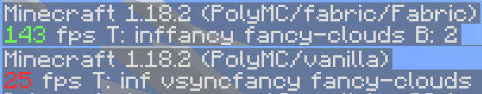
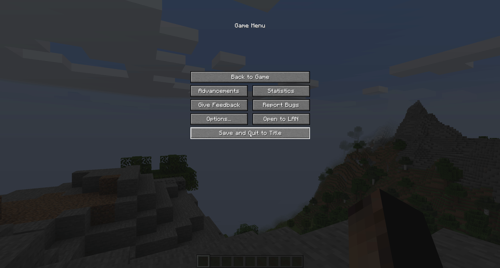

<!-- i didnt know you could make terrible readme file code, but apparently it is possible -->
<h1 align="center">A Guide to Minecraft Performance (WIP)</h1>

    
    
    
  

  
---

  

---
<!-- When you switch from all html to md 🤯-->
### Table of contents
- [📄 **Minecraft Performance Basics**](#Basics) <!-- Remember to write about small adjustments like render distance, particles etc.-->

<h2 align="center"><b>Minecraft Performance Basics</b></h2> <a name="Basics">

  
An explanation of the default <b>Vanilla</b> settings and how they affect <b>Performance</b>

 
<h3>Render Distance</h3> 

Render distance controls how much of the world is visible in chunks

  

 
<h3>Simulation Distance</h3> 

Render distance controls how much of the world is visible in chunks
  

<a name="Fabric-Optifine">
    
<a name="Fabric-Mods">
    
<a name="Performance">
    
<a name="Utility">
    
<a name="3rdparty">
    
<a name="Diff-Launchers">
    
<a name="Visual-Enhancements">
    
<a name="Other">

<!-- this is purely for planning purposes because i cant seem to make up my mind on how i want this to look

 Minecraft Performance Guide
table of contents
Configuring Default Settings
Minecraft Modding
Which Client is the best?
Which launcher is the best

i still dont like this

why cant i make a decision
  

Configuring your settings

Modifying your game

Modifying your launcher

-->
